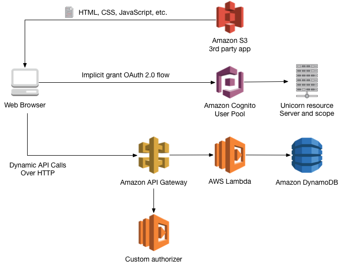

# Serverless Demo

This application uses AWS to generate a complete serverless website with the next tools:
1. Deploy static website using S3
2. Login with cognito
3. Use Lambda and Api gateway to do dynamic calls 
4. Consult dynamo DB with lambda
 

